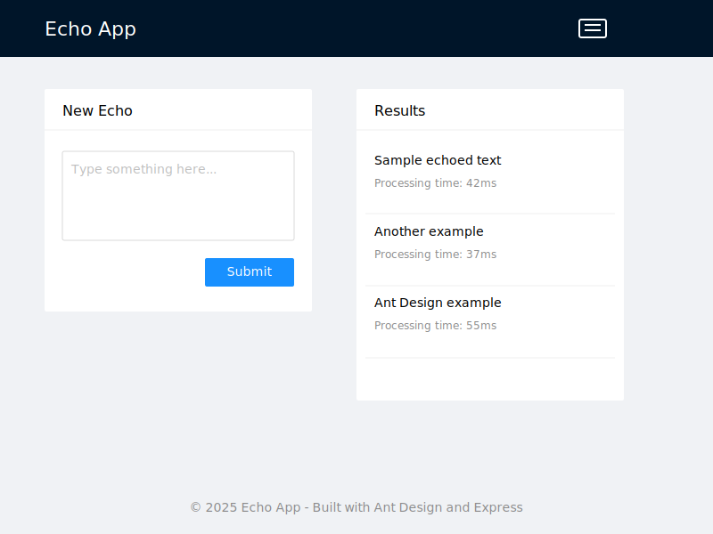

# Echo App

A simple web application that echoes user input with processing time metrics.



## Overview

Echo App is a lightweight, browser-based application that allows users to input text and see it echoed back with performance metrics. This application demonstrates basic DOM manipulation, event handling, and performance measurement in JavaScript.

## Features

- Clean, responsive user interface
- Text input with submit functionality
- Real-time display of echoed text
- Processing time measurement for each submission
- Mobile-friendly design

## Installation

1. Clone this repository:
   ```
   git clone https://github.com/yourusername/echo-app.git
   cd echo-app
   ```

2. Install dependencies:
   ```
   npm install
   ```

3. Serve the applications:
   ```
   # Development mode - serves both frontend and backend
   npx nx run-many --target=serve --projects=echo-client,echo-api --parallel
   
   # Or serve only the frontend
   npx nx serve echo-client
   
   # Or serve only the API
   npx nx serve echo-api
   ```

## Development

### Frontend (Angular)

The frontend application is built with Angular 17 and follows best practices for component structure, state management, and API communication:

```
echo-client/
├── src/
│   ├── app/
│   │   ├── components/
│   │   │   ├── echo-form/         # Input form component
│   │   │   └── echo-results/      # Results display component
│   │   ├── services/
│   │   │   └── echo.service.ts    # Service for API communication
│   │   ├── models/
│   │   │   └── echo.model.ts      # TypeScript interfaces
│   │   ├── app.component.ts       # Root component
│   │   └── app.module.ts          # Angular module definitions
│   ├── environments/              # Environment configuration
│   └── assets/                    # Static assets
```

### Backend (Express)

The Express API is structured with separation of concerns:

```
echo-api/
├── src/
│   ├── main.ts                    # Entry point
│   ├── app/
│   │   ├── controllers/
│   │   │   └── echo.controller.ts # Request handling
│   │   ├── services/
│   │   │   └── echo.service.ts    # Business logic
│   │   ├── models/
│   │   │   └── echo.model.ts      # Data models
│   │   └── routes/
│   │       └── api.routes.ts      # API route definitions
│   └── config/                    # Configuration

## Usage

1. Once the application is running, navigate to `http://localhost:4200` in your web browser
2. Enter text in the input field
3. Click the "SUBMIT" button or press Enter
4. View your echoed text in the results section on the right
5. Each result includes the processing time in milliseconds and a timestamp from the server

## Building for Production

To build the application for production deployment:

```bash
# Build both frontend and backend
npx nx run-many --target=build --projects=echo-client,echo-api --parallel --prod

# The output will be in the 'dist/' directory
# - Frontend: dist/apps/echo-client/
# - Backend: dist/apps/echo-api/
```

The production build includes:
- Minified Angular bundles with ahead-of-time compilation
- Optimized assets
- Production-ready Express server

## How It Works

The application uses vanilla JavaScript to:
- Capture user input from the textarea
- Measure processing time using the Performance API
- Create and display new DOM elements with the echoed text and timing information
- Maintain a history of previous submissions

## Technical Details

- Built as a monorepo using Nx for efficient workflows and code sharing
- Frontend implemented with Angular 17
- Backend powered by Express.js
- Organized as a full-stack application with clear separation of concerns
- Uses RxJS for reactive programming on the frontend
- Angular's HttpClient for API communication
- Express middleware for request handling and validation
- Fully responsive design with Angular Material components

### Project Structure

```
echo-app/
├── apps/
│   ├── echo-client/     # Angular frontend application
│   └── echo-api/        # Express backend API
├── libs/
│   ├── shared/
│   │   └── models/      # Shared interfaces and types
│   ├── ui/              # Reusable UI components
│   └── api-interfaces/  # Shared API contracts
├── tools/               # Build and development tools
└── nx.json              # Nx configuration
```

### API Integration

The Echo App interacts with a backend API:

- **Endpoint**: POST `/api/echo`
- **Request body**: JSON containing the text to echo (`{ "text": "user input" }`)
- **Response**: JSON with echoed text and timestamp (`{ "echo": "user input", "timestamp": "2025-04-18T12:34:56" }`)

#### Sequence Diagram

The following diagram illustrates the interaction flow between the user, Angular client application, Express API server, and database:


## Browser Compatibility

The Echo App is compatible with:
- Chrome (latest)
- Firefox (latest)
- Safari (latest)
- Edge (latest)

## Future Enhancements

Potential improvements for future versions:
- Save history to local storage
- Add options to clear history
- Implement text formatting options
- Add ability to share echoes via URL
- Implement dark mode

## License

MIT License

## Contributing

Contributions are welcome! Please feel free to submit a Pull Request.

1. Fork the repository
2. Create your feature branch (`git checkout -b feature/amazing-feature`)
3. Commit your changes (`git commit -m 'Add some amazing feature'`)
4. Push to the branch (`git push origin feature/amazing-feature`)
5. Open a Pull Request
